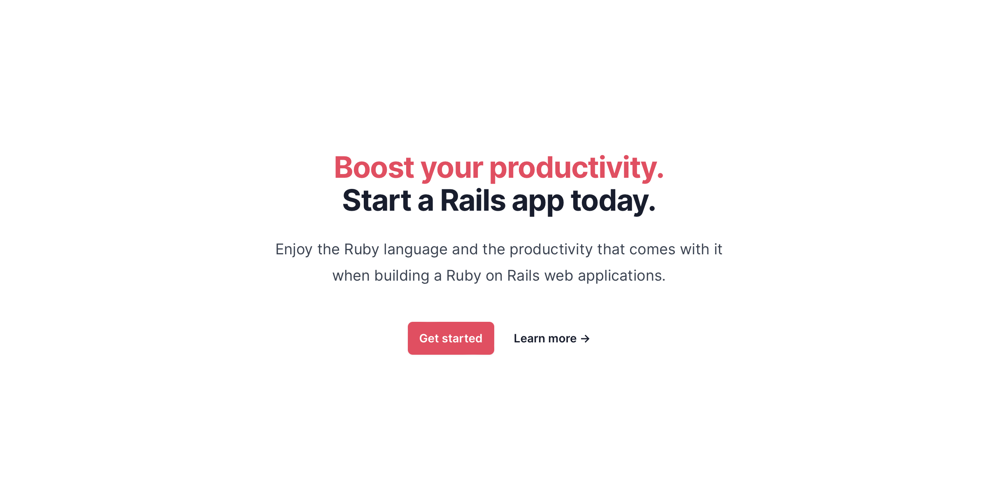

# Custom Rails application template

## Introduction

Over the years working with [Ruby](https://www.ruby-lang.org/) and [Ruby on Rails](https://rubyonrails.org), I have created many new applications as a starting point for a product, as a demo, or as a way to show a concept.

The `rails new` command provides a start but always needs additional work to set up a meaningful starting point. Ruby on Rails supports an application template option that allows us to pass a template file in the application initialization to customize the newly created application.

This is what this repository is about; it is a Ruby on Rails application template that makes decisions and starting configurations for additional gems.

## Template configuration

As with any default configuration, the configuration proposed by this template will not meet everyone's needs, but in many cases, it will be good enough. Few setup options are set to be a default in new Ruby on Rails applications for the upcoming version 8.

Here is the list of changes to the base Rails application; please be mindful to review or change configuration and to remove or add configuration settings according to your needs. 
**TailwindCSS and SQLite3 configurations are added only if they were set in the `rails new` command.**

- ActiveStorage was set up and ready to use.
    - S3 AWS gem was added but only for production.
    - Configure `config/storage.yml` properly.
    - Review `config/application.rb` for ActiveStorage proxy if needed.
- ActionText was set up and ready to be used.
- [ActionPolicy](https://actionpolicy.evilmartians.io/) was set up and ready to be used.
- [Litestack](https://github.com/oldmoe/litestack) was setup. Review additional configuration options.
- [LetterOpener](https://github.com/ryanb/letter_opener) was setup for development.
- Brakeman, Bundle Audit, and Standard were added for development. Also, the `.solargraph.yml` configuration file along with `.rubocop.yml` and `.standard.yml`.
- [Lograge](https://github.com/roidrage/lograge) was added and set up for production.
- [Rails I18n](https://github.com/svenfuchs/rails-i18n) gem was added; review configuration at `config/application.rb`
- [Meta Tags](https://github.com/kpumuk/meta-tags) gem was added; review the `config/initializers/meta_tags.rb` configuration, and set your meta tags.
- [tailwindcss-rails](https://github.com/rails/tailwindcss-rails) was added, it was set up with a default color scheme that can be used with `*-skin-{key}`, the keys and colors are defined at `app/assets/stylesheets/config.css` file.
- [Solid Queue](https://github.com/basecamp/solid_queue) gem was added and set up for production and development.
  - When the database is SQLite3, then a second database is set for the queue (queue database); from now on, you need to generate migrations with the key `--database primary` and execute db commands with `:primary` append, for example: `bin/rails db:migrate:primary`.
  - [Mission Control-Jobs](https://github.com/basecamp/mission_control-jobs) was set up, review documentation to secure the `/jobs` endpoint.
- Rack Attack was set up and ready to use. Review Rack Attack's initializer for additional configuration.

## Getting Started

To create a new Ruby on Rails application with this template, first clone the repository:

```bash
git clone https://github.com/mariochavez/rails-app-template.git
```

Then configure your Rails new command as usual and add the option `-m` at the end with the path to the template cloned repository. Example:

```bash
rails new demo -d sqlite3 --skip-jbuilder --css=tailwind --javascript=importmap --skip-action-mailbox -a propshaft -m ./rails-app-template/mac-rails.rb
```

The process to create the new application starts as usual, but it will stop and ask you for the port where you want to run this application; if you hit enter, it will use port 3000 as usual.

```bash
Default port for your app? (3000)
```

This value is essential because the template creates a Procfile.dev file with your set port. Overmind uses the Procfile.dev to start your Rails server. To set up Overmind, follow [installation instructions](https://github.com/DarthSim/overmind?tab=readme-ov-file#installation).

After a few minutes, change to the newly created application folder and start your application with (Given you set up previously Overmind):

```bash
overmind start
```

If everything is ok, you should see in the terminal the following:

```bash
solid_queue | Started with pid 83237...
web         | Started with pid 83235...
css         | Started with pid 83236...
web         | => Booting Puma
web         | => Rails 7.1.3.2 application starting in development
web         | => Run `bin/rails server --help` for more startup options
web         | Puma starting in single mode...
web         | * Puma version: 6.4.2 (ruby 3.2.2-p53) ("The Eagle of Durango")
web         | *  Min threads: 5
web         | *  Max threads: 5
web         | *  Environment: development
web         | *          PID: 83239
web         | * Listening on http://127.0.0.1:3000
web         | * Listening on http://[::1]:3000
web         | Use Ctrl-C to stop
solid_queue | [SolidQueue] Starting Dispatcher(pid=83283, hostname=rails-host.local, metadata={:polling_interval=>1, :batch_size=>500})
solid_queue | [SolidQueue] Starting Worker(pid=83284, hostname=rails-host.local, metadata={:polling_interval=>0.1, :queues=>"*", :thread_pool_size=>5})
css         |
css         | Rebuilding...
css         |
css         | Done in 269ms.
```

Point your browser to the localhost and the port you set to get the welcome page.



## Contributing

Contributions are welcome! Follow these steps to contribute to the project:

1. Fork the repository
2. Create your feature branch (`git checkout -b feature/YourFeature`)
3. Commit your changes (`git commit -am 'Add some feature'`)
4. Push to the branch (`git push origin feature/YourFeature`)
5. Create a new Pull Request

Please make sure to update tests as appropriate.

## License

This project is licensed under the [MIT License](https://opensource.org/licenses/MIT).
